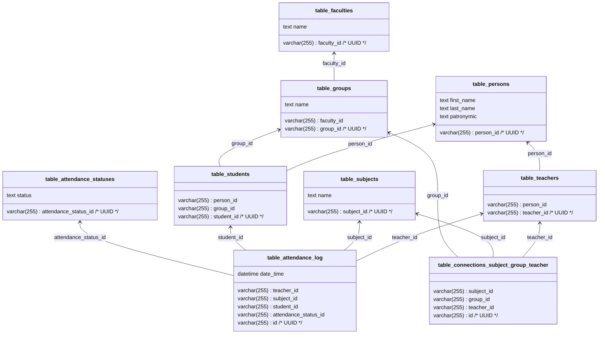

```mermaid
classDiagram
direction BT
class table_attendance_log {
   datetime date_time
   varchar(255) teacher_id
   varchar(255) subject_id
   varchar(255) student_id
   varchar(255) attendance_status_id
   varchar(255) id  /* UUID */
}
class table_attendance_statuses {
   text status
   varchar(255) attendance_status_id  /* UUID */
}
class table_connections_subject_group_teacher {
   varchar(255) subject_id
   varchar(255) group_id
   varchar(255) teacher_id
   varchar(255) id  /* UUID */
}
class table_faculties {
   text name
   varchar(255) faculty_id  /* UUID */
}
class table_groups {
   text name
   varchar(255) faculty_id
   varchar(255) group_id  /* UUID */
}
class table_persons {
   text first_name
   text last_name
   text patronymic
   varchar(255) person_id  /* UUID */
}
class table_students {
   varchar(255) person_id
   varchar(255) group_id
   varchar(255) student_id  /* UUID */
}
class table_subjects {
   text name
   varchar(255) subject_id  /* UUID */
}
class table_teachers {
   varchar(255) person_id
   varchar(255) teacher_id  /* UUID */
}

table_attendance_log  -->  table_attendance_statuses : attendance_status_id
table_attendance_log  -->  table_students : student_id
table_attendance_log  -->  table_subjects : subject_id
table_attendance_log  -->  table_teachers : teacher_id
table_connections_subject_group_teacher  -->  table_groups : group_id
table_connections_subject_group_teacher  -->  table_subjects : subject_id
table_connections_subject_group_teacher  -->  table_teachers : teacher_id
table_groups  -->  table_faculties : faculty_id
table_students  -->  table_groups : group_id
table_students  -->  table_persons : person_id
table_teachers  -->  table_persons : person_id
```
